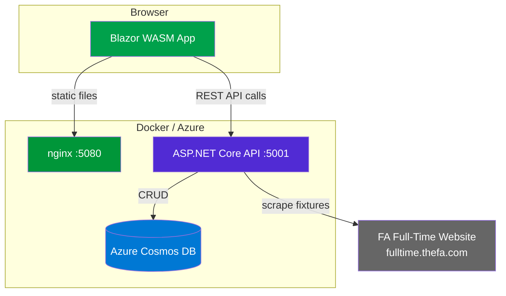
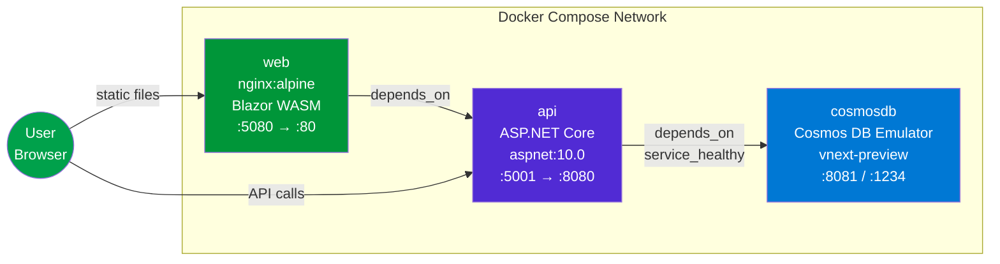
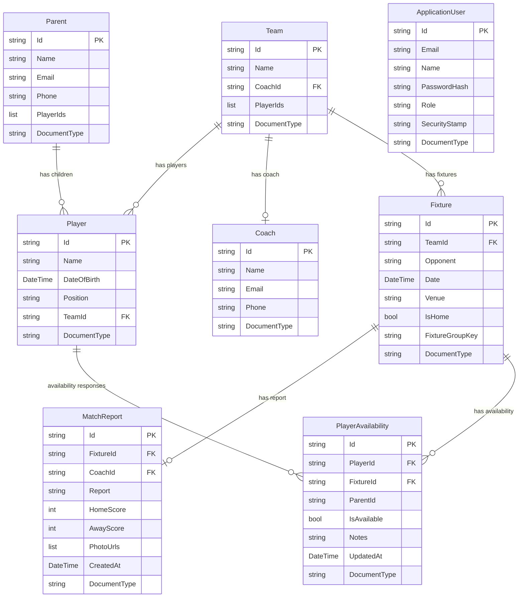
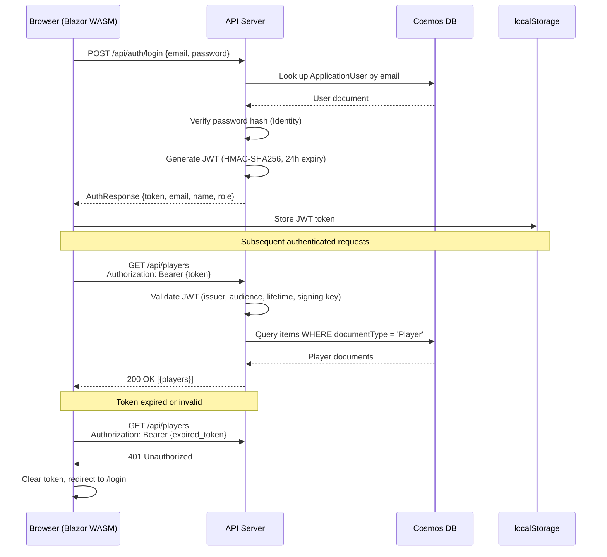
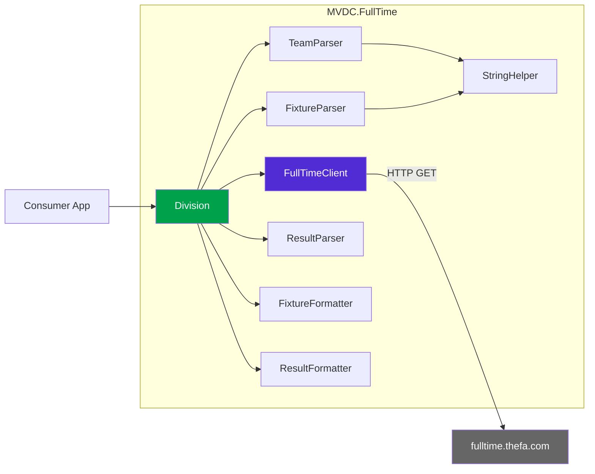
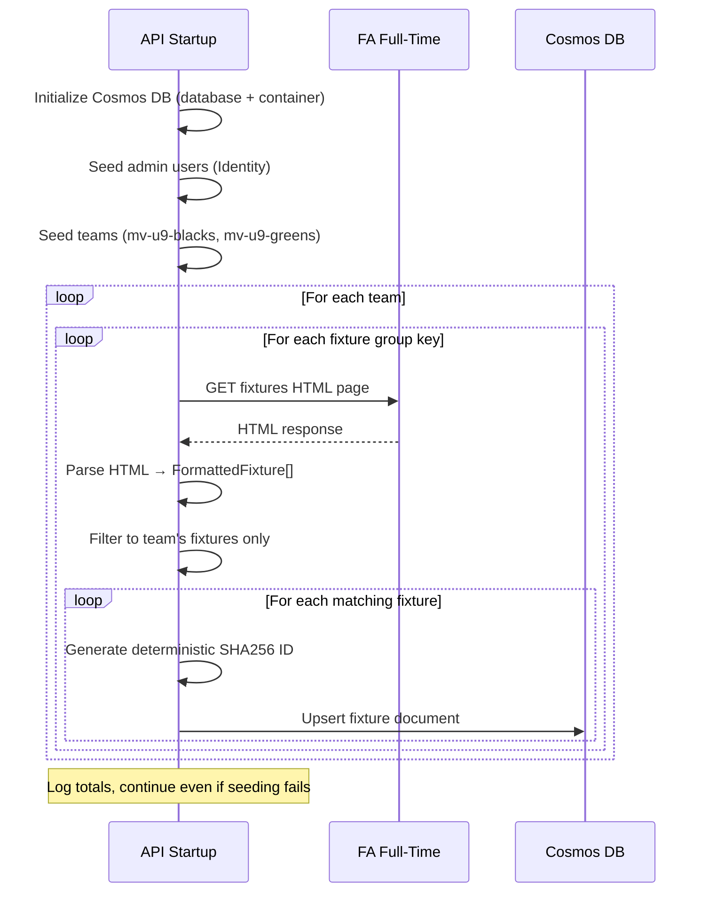
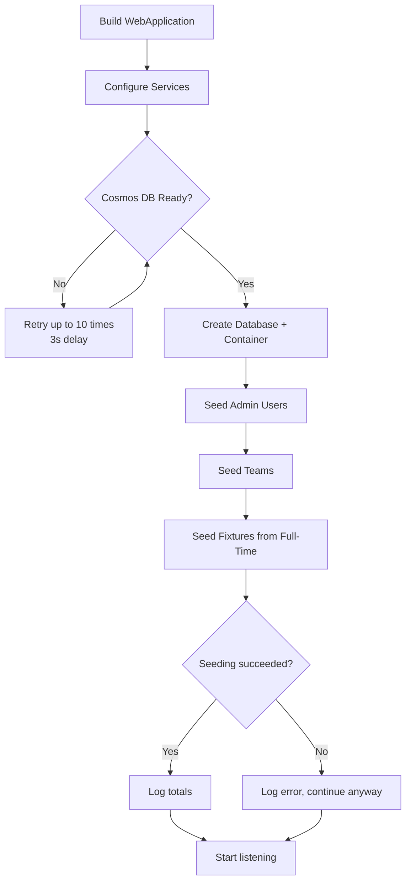
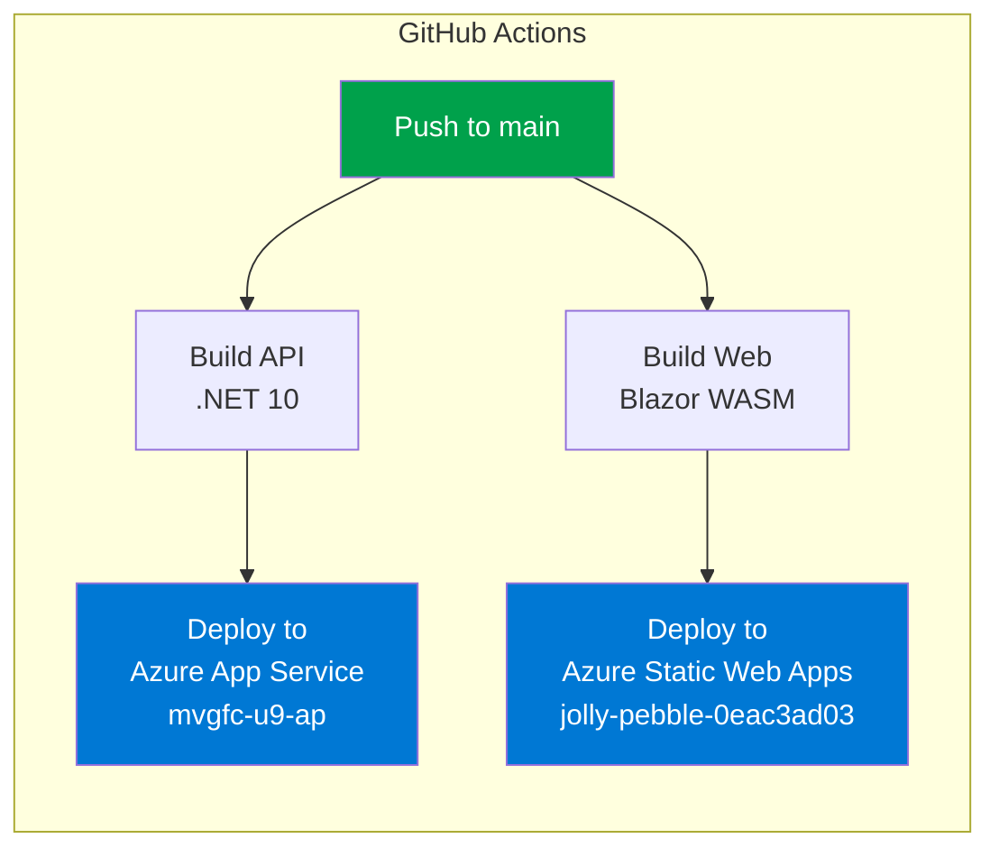

# MVDC

**Mole Valley District Club** — a .NET 10 application for managing Mole Valley Girls Football Club (MVGFC). Blazor WebAssembly frontend, ASP.NET Core API backend, Azure Cosmos DB storage, and a standalone NuGet library for scraping FA Full-Time fixture data.

## Architecture



> **Key point:** The Blazor WASM app runs entirely in the browser. nginx only serves the static files — all API calls go directly from the browser to the API on port 5001, not through nginx.

## Tech Stack

| Layer | Technology | Version |
|-------|-----------|---------|
| Frontend | Blazor WebAssembly | .NET 10 |
| Backend | ASP.NET Core Web API | .NET 10 |
| Database | Azure Cosmos DB (NoSQL) | SDK 3.38.1 |
| Auth | ASP.NET Core Identity + JWT Bearer | 10.0.5 |
| Scraping | MVDC.FullTime (HtmlAgilityPack) | 1.12.2 |
| Testing | xUnit + NSubstitute | 2.9.3 / 5.3.0 |
| Containers | Docker Compose | Multi-stage builds |
| CI/CD | GitHub Actions | Azure App Service + Static Web Apps |

## Project Structure

```
MVDC/
├── src/
│   ├── MVDC.Api/                    # ASP.NET Core Web API
│   │   ├── Controllers/             # 8 API controllers
│   │   ├── Identity/                # CosmosUserStore, CosmosRoleStore
│   │   ├── Services/                # CosmosRepository<T>, FullTimeFixtureSeeder
│   │   ├── Dockerfile               # Multi-stage, aspnet:10.0
│   │   ├── Program.cs               # DI, Cosmos init, seeding, middleware
│   │   └── appsettings.json
│   ├── MVDC.Web/                    # Blazor WebAssembly frontend
│   │   ├── Auth/                    # JWT auth state provider + handler
│   │   ├── Layout/                  # MainLayout, NavMenu
│   │   ├── Pages/                   # 10 Blazor pages
│   │   ├── wwwroot/css/app.css      # MVGFC-branded styles
│   │   ├── Dockerfile               # Multi-stage, nginx:alpine
│   │   ├── nginx.conf               # Security headers, caching, SPA fallback
│   │   ├── docker-entrypoint.sh     # Injects API_BASE_ADDRESS at runtime
│   │   └── Program.cs
│   ├── MVDC.Shared/                 # Shared models (referenced by Api + Web)
│   │   └── Models/                  # Player, Coach, Team, Fixture, etc.
│   ├── MVDC.FullTime/               # Standalone NuGet library
│   │   ├── Models/                  # FormattedFixture, FormattedResult
│   │   ├── Parsers/                 # TeamParser, FixtureParser, ResultParser
│   │   ├── Formatters/              # FixtureFormatter, ResultFormatter
│   │   ├── Helpers/                 # StringHelper
│   │   ├── Division.cs              # Main facade class
│   │   ├── FullTimeClient.cs        # HTTP client wrapper
│   │   └── IFullTimeClient.cs       # Interface for testability
│   └── MVDC.FullTime.Console/       # CLI tool for FullTime library
├── tests/
│   └── MVDC.FullTime.Tests/         # 59 xUnit tests
│       └── Examples/                # HTML fixture files for parser tests
├── .github/workflows/               # CI/CD pipelines
├── docker-compose.yml               # 3 services: cosmosdb, api, web
├── MVDC.slnx                        # Solution (Api, Web, Shared only)
└── AGENTS.md                        # Coding agent instructions
```

> **Note:** The solution file only includes Api, Web, and Shared. The FullTime library and tests must be built/tested by path.

## Prerequisites

- [.NET 10 SDK](https://dotnet.microsoft.com/download/dotnet/10.0)
- [Docker Desktop](https://www.docker.com/products/docker-desktop/) (for local development with Cosmos DB emulator)

## Getting Started

### Docker Compose (recommended)

The fastest way to run everything locally — starts Cosmos DB emulator, API, and Web:

```bash
docker compose build
docker compose up -d
```

| Service | URL | Description |
|---------|-----|-------------|
| Web (Blazor) | http://localhost:5080 | Frontend application |
| API | http://localhost:5001 | REST API |
| Cosmos DB | https://localhost:8081 | Database endpoint |
| Data Explorer | http://localhost:1234 | Cosmos DB data browser |

**Default admin accounts** (seeded automatically):

| Email | Password | Role |
|-------|----------|------|
| `admin@mvgfc.co.uk` | `Admin123!` | Admin |
| `pete.field@gmail.com` | `1Plus2=3` | Admin |

### Local Development (without Docker)

1. Start the Cosmos DB emulator separately (or use an Azure Cosmos DB instance)
2. Configure connection strings in `appsettings.Development.json`
3. Run the API and Web projects:

```bash
# Terminal 1 — API
dotnet run --project src/MVDC.Api/

# Terminal 2 — Web
dotnet run --project src/MVDC.Web/
```

### Build Commands

```bash
# Build solution (Api, Web, Shared)
dotnet build

# Build FullTime library separately
dotnet build src/MVDC.FullTime/

# Build tests
dotnet build tests/MVDC.FullTime.Tests/
```

## Docker Topology



### Container Details

| Service | Image | Internal Port | External Port | Health Check |
|---------|-------|---------------|---------------|--------------|
| `cosmosdb` | `mcr.microsoft.com/cosmosdb/linux/azure-cosmos-emulator:vnext-preview` | 8081, 1234 | 8081, 1234 | `curl http://localhost:8080/ready` |
| `api` | Multi-stage `aspnet:10.0` (Ubuntu) | 8080 | 5001 | — |
| `web` | Multi-stage `nginx:alpine` | 80 | 5080 | — |

Both application images use non-root users (`appuser`) and multi-stage builds for minimal image size.

### Cosmos DB Emulator Configuration

The vNext preview emulator requires specific configuration:

- **Environment variable:** `PROTOCOL=https`
- **SDK options:** `ConnectionMode.Gateway`, `LimitToEndpoint = true`
- **SSL:** `DangerousAcceptAnyServerCertificateValidator` (emulator uses self-signed certs)
- **Account key:** `C2y6yDjf5/R+ob0N8A7Cgv30VRDJIWEHLM+4QDU5DE2nQ9nDuVTqobD4b8mGGyPMbIZnqyMsEcaGQy67XIw/Jw==`

## Data Model

All entities are stored in a single Cosmos DB container (`Items`) with partition key `/id`. A `documentType` field discriminates between entity types.



### Entity Details

| Entity | Document Type | ID Strategy | Key Annotations |
|--------|--------------|-------------|-----------------|
| Player | `Player` | GUID | `[Required]` Name, DateOfBirth, Position |
| Coach | `Coach` | GUID | `[Required]` Name, `[EmailAddress]` Email, `[Phone]` Phone |
| Team | `Team` | Deterministic slug (`mv-u9-blacks`) | `[Required]` Name |
| Parent | `Parent` | GUID | `[Required]` Name, `[EmailAddress]` Email, `[Phone]` Phone |
| Fixture | `Fixture` | SHA256 deterministic hash | `[Required]` TeamId, Opponent, Date, Venue |
| MatchReport | `MatchReport` | GUID | `[Required]` FixtureId, Report |
| PlayerAvailability | `PlayerAvailability` | GUID | `[Required]` PlayerId, FixtureId |
| ApplicationUser | `User` | GUID | Identity-managed |

### Repository Pattern

All entities use a generic `IRepository<T>` backed by `CosmosRepository<T>`:

```
GetAllAsync(CancellationToken)        → IEnumerable<T>
GetByIdAsync(string id, CT)           → T?
CreateAsync(T item, CT)               → T
UpdateAsync(string id, T item, CT)    → T       (uses UpsertItemAsync)
DeleteAsync(string id, CT)            → void
```

Each entity type is registered as a scoped service with its own `documentType` discriminator.

## Authentication and Authorization



### Roles and Permissions

| Role | Read (own data) | Read (all) | Create/Update | Delete | Register Users |
|------|-----------------|------------|---------------|--------|----------------|
| **Admin** | Yes | Yes | Yes | Yes | Yes |
| **Coach** | Yes | Yes | Yes | No | No |
| **Parent** | Yes | Yes | No | No | No |

### Public Endpoints (no auth required)

- `GET /api/fixtures` — all fixtures
- `GET /api/fixtures/{id}` — single fixture
- `GET /api/matchreports` — all match reports
- `GET /api/matchreports/{id}` — single match report
- `POST /api/auth/login` — authentication

### JWT Configuration

| Setting | Default | Description |
|---------|---------|-------------|
| `Jwt:Key` | *(required)* | HMAC-SHA256 signing key (min 32 chars) |
| `Jwt:Issuer` | `MVDC` | Token issuer claim |
| `Jwt:Audience` | `MVDC` | Token audience claim |
| `Jwt:ExpiryInHours` | `24` | Token lifetime |

JWT claims include: `NameIdentifier`, `Email`, `Name`, `Role`.

## API Reference

All endpoints are under `/api/`. Controllers use `[ApiController]` and return standard HTTP status codes.

### Auth (`/api/auth`)

| Method | Route | Auth | Description |
|--------|-------|------|-------------|
| `POST` | `/api/auth/login` | Anonymous | Authenticate and receive JWT |
| `POST` | `/api/auth/register` | Admin | Register a new user with role |
| `GET` | `/api/auth/me` | Authenticated | Get current user info |

### Players (`/api/players`)

| Method | Route | Auth | Description |
|--------|-------|------|-------------|
| `GET` | `/api/players` | Authenticated | List all players |
| `GET` | `/api/players/{id}` | Authenticated | Get player by ID |
| `POST` | `/api/players` | Admin, Coach | Create player |
| `PUT` | `/api/players/{id}` | Admin, Coach | Update player |
| `DELETE` | `/api/players/{id}` | Admin | Delete player |

### Coaches (`/api/coaches`)

| Method | Route | Auth | Description |
|--------|-------|------|-------------|
| `GET` | `/api/coaches` | Authenticated | List all coaches |
| `GET` | `/api/coaches/{id}` | Authenticated | Get coach by ID |
| `POST` | `/api/coaches` | Admin, Coach | Create coach |
| `PUT` | `/api/coaches/{id}` | Admin, Coach | Update coach |
| `DELETE` | `/api/coaches/{id}` | Admin | Delete coach |

### Teams (`/api/teams`)

| Method | Route | Auth | Description |
|--------|-------|------|-------------|
| `GET` | `/api/teams` | Authenticated | List all teams |
| `GET` | `/api/teams/{id}` | Authenticated | Get team by ID |
| `POST` | `/api/teams` | Admin, Coach | Create team |
| `PUT` | `/api/teams/{id}` | Admin, Coach | Update team |
| `PUT` | `/api/teams/{id}/players` | Admin, Coach | Assign player IDs to team |
| `DELETE` | `/api/teams/{id}` | Admin | Delete team |

### Parents (`/api/parents`)

| Method | Route | Auth | Description |
|--------|-------|------|-------------|
| `GET` | `/api/parents` | Authenticated | List all parents |
| `GET` | `/api/parents/{id}` | Authenticated | Get parent by ID |
| `POST` | `/api/parents` | Admin, Coach | Create parent |
| `PUT` | `/api/parents/{id}` | Admin, Coach | Update parent |
| `DELETE` | `/api/parents/{id}` | Admin | Delete parent |

### Fixtures (`/api/fixtures`)

| Method | Route | Auth | Description |
|--------|-------|------|-------------|
| `GET` | `/api/fixtures` | Anonymous | List all fixtures |
| `GET` | `/api/fixtures/{id}` | Anonymous | Get fixture by ID |
| `POST` | `/api/fixtures/refresh` | Admin, Coach | Re-fetch fixtures from Full-Time |
| `POST` | `/api/fixtures` | Admin, Coach | Create fixture |
| `PUT` | `/api/fixtures/{id}` | Admin, Coach | Update fixture |
| `DELETE` | `/api/fixtures/{id}` | Admin | Delete fixture |

### Match Reports (`/api/matchreports`)

| Method | Route | Auth | Description |
|--------|-------|------|-------------|
| `GET` | `/api/matchreports` | Anonymous | List all match reports |
| `GET` | `/api/matchreports/{id}` | Anonymous | Get match report by ID |
| `POST` | `/api/matchreports` | Admin, Coach | Create match report |
| `PUT` | `/api/matchreports/{id}` | Admin, Coach | Update match report |
| `DELETE` | `/api/matchreports/{id}` | Admin | Delete match report |

### Availability (`/api/availability`)

| Method | Route | Auth | Description |
|--------|-------|------|-------------|
| `GET` | `/api/availability` | Authenticated | List all availability records |
| `GET` | `/api/availability/{id}` | Authenticated | Get availability by ID |
| `POST` | `/api/availability` | Authenticated | Create availability record |
| `PUT` | `/api/availability/{id}` | Authenticated | Update availability record |
| `DELETE` | `/api/availability/{id}` | Authenticated | Delete availability record |

### Common Response Patterns

| Status | Meaning |
|--------|---------|
| `200 OK` | Successful read or update |
| `201 Created` | Resource created (with `Location` header) |
| `204 No Content` | Successful delete |
| `400 Bad Request` | Validation error or ID mismatch |
| `401 Unauthorized` | Missing or invalid JWT |
| `403 Forbidden` | Insufficient role permissions |
| `404 Not Found` | Resource not found |
| `409 Conflict` | Duplicate resource |

## Blazor Pages

| Route | Page | Auth Required | Description |
|-------|------|---------------|-------------|
| `/` | Home | No | Hero banner, latest match report cards with scores |
| `/login` | Login | No | Email/password login form |
| `/players` | Players | Yes | CRUD table for players |
| `/coaches` | Coaches | Yes | CRUD table for coaches |
| `/parents` | Parents | Yes | CRUD table for parents |
| `/teams` | Teams | Yes | CRUD table for teams with player assignment |
| `/fixtures` | Fixtures | No | Fixture list with team filter and Full-Time refresh button |
| `/matchreports` | Match Reports | No (read) / Yes (write) | Collapsible match reports with team filter |
| `/availability` | Availability | Yes | Player availability per fixture |

### UI Design

The frontend matches the [MVGFC website](https://www.mvgfc.co.uk/) branding:

| Element | Value |
|---------|-------|
| Primary accent | `#00a14b` (MVGFC green) |
| Heading font | Oswald (uppercase) |
| Body font | Open Sans |
| Navbar | White background, dark text |
| Footer | Dark (`#222222`), sticky |
| Content width | Max 1080px |
| Forms | Blazor `EditForm` with `DataAnnotationsValidator` |
| Error display | Bootstrap dismissible alerts |
| Delete confirmations | JS `confirm()` via `IJSRuntime` |

## MVDC.FullTime Library

A standalone NuGet package that scrapes the [FA Full-Time](https://fulltime.thefa.com) website for fixture, result, and team data. This is a C# port of the PHP package [jadgray/full-time-api](https://packagist.org/packages/jadgray/full-time-api).



### Package Details

| Property | Value |
|----------|-------|
| Package ID | `MVDC.FullTime` |
| Version | `1.0.0` |
| License | MIT |
| Target | `net10.0` |
| Dependency | HtmlAgilityPack 1.12.2 |

### Public API

#### `IFullTimeClient`

```csharp
Task<string> GetAsync(string url, CancellationToken cancellationToken = default);
```

#### `Division` — main facade

```csharp
// Get team names from the fixture group dropdown
Task<IReadOnlyList<string>> GetTeamsAsync(
    int seasonId, string groupId, CancellationToken ct = default);

// Get raw fixture data (string arrays of table cells)
Task<IReadOnlyList<string[]>> GetFixturesAsync(
    int seasonId, string groupId, CancellationToken ct = default);

// Get parsed/formatted fixtures
Task<IReadOnlyList<FormattedFixture>> GetFormattedFixturesAsync(
    int seasonId, string groupId,
    bool includeTbcFixtures = true, bool includeCupFixtures = true,
    string? dateFormat = null, string? timeFormat = null,
    CancellationToken ct = default);

// Get raw result data (string arrays)
Task<IReadOnlyList<string[]>> GetResultsAsync(
    int seasonId, string groupId, CancellationToken ct = default);

// Get parsed/formatted results
Task<IReadOnlyList<FormattedResult>> GetFormattedResultsAsync(
    int seasonId, string groupId,
    string? dateFormat = null, string? timeFormat = null,
    CancellationToken ct = default);
```

#### Models

**`FormattedFixture`** (sealed record):

| Property | Type |
|----------|------|
| `Date` | `string` (e.g. `"15/03/2025"`) |
| `Time` | `string` (e.g. `"10:00"`) |
| `Home` | `string` |
| `Away` | `string` |
| `FixtureType` | `string` |

**`FormattedResult`** (sealed record):

| Property | Type |
|----------|------|
| `Date` | `string` |
| `Time` | `string` |
| `Home` | `string` |
| `HomeScore` | `string?` |
| `Away` | `string` |
| `AwayScore` | `string?` |
| `FullScore` | `string` |

### Usage Example

```csharp
using MVDC.FullTime;

var client = new FullTimeClient(new HttpClient());
var division = new Division(client);

// Mole Valley Girls U9 — Season 310037110, Group 1_478076013
var fixtures = await division.GetFormattedFixturesAsync(310037110, "1_478076013");

foreach (var f in fixtures)
    Console.WriteLine($"{f.Date} {f.Time} — {f.Home} vs {f.Away}");
```

### Console App

The `MVDC.FullTime.Console` app provides a CLI for testing. Defaults to Mole Valley Girls U9 Blacks:

```bash
dotnet run --project src/MVDC.FullTime.Console/
```

## Fixture Seeding

On API startup, the `FullTimeFixtureSeeder` automatically fetches fixtures from FA Full-Time and upserts them into Cosmos DB.



### Configured Teams

| Team | Team ID | Fixture Group Keys |
|------|---------|-------------------|
| Mole Valley Girls U9 Blacks | `mv-u9-blacks` | `1_223342503` (U9 Lime v3), `1_478076013` (U9 Grey v4) |
| Mole Valley Girls U9 Greens | `mv-u9-greens` | `1_834940432` (U9 Black v4) |

**Deterministic IDs:** Fixtures are identified by a SHA256 hash of `{date}|{home}|{away}|{groupKey}`, truncated to 16 hex characters. This prevents duplicates on restart while allowing the seeder to run idempotently via `UpsertItemAsync`.

## API Startup Sequence



## nginx Configuration

The Web container uses nginx to serve the Blazor WASM static files:

| Feature | Configuration |
|---------|--------------|
| SPA routing | `try_files $uri $uri/ /index.html` |
| WASM support | Custom MIME type `application/wasm` |
| Compression | `gzip_static on` + dynamic gzip for wasm, js, json, css, html |
| Security headers | `X-Content-Type-Options: nosniff`, `X-Frame-Options: DENY`, `Referrer-Policy: strict-origin-when-cross-origin` |

### Cache Policy

| Asset | Cache Duration |
|-------|---------------|
| `appsettings*.json` | No cache (`no-store, must-revalidate`) |
| `index.html` | No cache |
| `/_framework/*` (Blazor runtime) | 1 year, immutable (content-hashed) |
| Images, fonts | 1 day |
| CSS, JS | 1 hour, must-revalidate |

## Testing

59 xUnit tests cover the MVDC.FullTime library — parsers, formatters, and helpers.

```bash
# Run all tests
dotnet test tests/MVDC.FullTime.Tests/

# Run a specific test class
dotnet test tests/MVDC.FullTime.Tests/ --filter "FullyQualifiedName~FixtureParserTests"

# Run a single test
dotnet test tests/MVDC.FullTime.Tests/ --filter "FullyQualifiedName~FixtureParserTests.Parse_ReturnsSevenFixtures"

# Verbose output
dotnet test tests/MVDC.FullTime.Tests/ --verbosity normal
```

### Test Structure

| Test Class | Tests | Description |
|-----------|-------|-------------|
| `FixtureParserTests` | Parsing HTML fixture tables |
| `ResultParserTests` | Parsing HTML result listings |
| `TeamParserTests` | Parsing team dropdown options |
| `FixtureFormatterTests` | Formatting raw fixture data with date/time options, TBC/cup filtering |
| `ResultFormatterTests` | Formatting raw result data with score extraction |
| `StringHelperTests` | Whitespace normalization |
| `DivisionTests` | Integration of client → parser → formatter via `Division` facade |
| `FullTimeClientTests` | HTTP client behaviour |

Tests use HTML fixtures from `tests/MVDC.FullTime.Tests/Examples/` loaded via `File.ReadAllText`. NSubstitute is used for mocking `IFullTimeClient`.

## CI/CD



### API Deployment (`main_mvgfc-u9-ap.yml`)

- **Trigger:** Push to `main` or manual dispatch
- **Build:** `dotnet build --configuration Release` → `dotnet publish`
- **Deploy:** Azure App Service via publish profile
- **Target:** `mvgfc-u9-ap` (Production slot)

### Web Deployment (`azure-static-web-apps-jolly-pebble-0eac3ad03.yml`)

- **Trigger:** Push to `main` or pull request events
- **Build:** Blazor WASM publish from `src/MVDC.Web` → `wwwroot`
- **Deploy:** Azure Static Web Apps with OIDC authentication
- **PR previews:** Staging environments created on PR open, torn down on PR close

## Configuration Reference

### API (`appsettings.json` / Environment Variables)

| Key | Env Override | Description | Required |
|-----|-------------|-------------|----------|
| `CosmosDb:ConnectionString` | `CosmosDb__ConnectionString` | Cosmos DB connection string | Yes |
| `CosmosDb:DatabaseName` | `CosmosDb__DatabaseName` | Database name (default: `MVDC`) | No |
| `CosmosDb:ContainerName` | `CosmosDb__ContainerName` | Container name (default: `Items`) | No |
| `CosmosDb:UseEmulator` | `CosmosDb__UseEmulator` | Enable emulator mode (SSL bypass, Gateway) | No |
| `Jwt:Key` | `Jwt__Key` | JWT signing key (min 32 chars) | Yes |
| `Jwt:Issuer` | `Jwt__Issuer` | JWT issuer (default: `MVDC`) | No |
| `Jwt:Audience` | `Jwt__Audience` | JWT audience (default: `MVDC`) | No |
| `Jwt:ExpiryInHours` | `Jwt__ExpiryInHours` | Token expiry (default: `24`) | No |
| `Cors:AllowedOrigins` | `Cors__AllowedOrigins` | Comma-separated allowed origins | No |
| `Seed:AdminPassword` | `Seed__AdminPassword` | Password for admin@mvgfc.co.uk | No |
| `Seed:PetePassword` | `Seed__PetePassword` | Password for pete.field@gmail.com | No |

### Web (`wwwroot/appsettings.json` / Environment Variables)

| Key | Env Override | Description |
|-----|-------------|-------------|
| `ApiBaseAddress` | `API_BASE_ADDRESS` | URL of the API server (injected at container startup) |

## NuGet Package Versions

| Package | Version | Project |
|---------|---------|---------|
| `Microsoft.AspNetCore.Authentication.JwtBearer` | 10.0.5 | Api |
| `Microsoft.Azure.Cosmos` | 3.38.1 | Api |
| `Newtonsoft.Json` | 13.0.3 | Api |
| `Microsoft.AspNetCore.Components.Authorization` | 10.0.5 | Web |
| `Microsoft.AspNetCore.Components.WebAssembly` | 10.0.2 | Web |
| `System.IdentityModel.Tokens.Jwt` | 8.16.0 | Web |
| `HtmlAgilityPack` | 1.12.2 | FullTime |
| `Microsoft.NET.Test.Sdk` | 17.14.1 | Tests |
| `xunit` | 2.9.3 | Tests |
| `xunit.runner.visualstudio` | 3.1.1 | Tests |
| `NSubstitute` | 5.3.0 | Tests |
